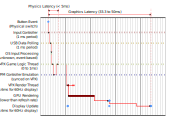

# Latency

I don't think that max/average latency is much of a problem nowadays (especially with your latest changes), BUT the variance in it.
Cause the higher the ms variance, the more inconsistent one can hit shots (brain can adapt to a bit of latency, but one cannot predict the latency variance for each individual shot obviously).

I think your idea regarding high-time-resolution flipper button is really interesting. This is something I have been spending time lately, so here are a few insights around the latency question I gathered along, that could eventually prove useful. First, when speaking of latency, I think there are 2 different perceived latency, one regarding gameplay (ability to do flipper tricks,...) and one visually perceived that I would define like this:
- gameplay latency = difference between expected behavior and simulated one if ones would play with closed eyes,
- visual latency = the same but with the eyes opened :) so adds the rendering / framebuffer etc. latency to gameplay latency (won't go into this here)

Gameplay latency is difficult to measure but even to define since it implies multiple component. A classic sequence on a real pinball would be the following:
- move fingers, press button, mechanical contact, electric signal available to controller CPU (mostly instantaneous),
- Controller CPU strobe its switch matrix and update its internal copy in RAM,
- Controller CPU process the state change and toggle the flipper solenoid output,
- Solenoid coils current ramp up and flipper move (with varying power).

The switch contact to solenoid output change has been measured to be around 1ms on WPC fliptronnics.

For VPX, it becomes like this:
1. move fingers, press button, mechanical contact, electric signal available to pinball input device (mostly instantaneous),
2. pinball input device process, then communicates with computer through USB (with all that implies and you already described)
3. computer input API process and makes this data available to VPX
4. VPX process input and report it to script which updates a switch state table for PinMame
5. PinMame reads switch state table and emulate Controller CPU, in turns toggling a virtual solenoid output
6. VPX synchronize with PinMame and report solenoid state change to script which request physic engine to move flipper
7. VPX's physics engine actually move the flipper

This sequence happens with the following threading setup:
- All version of VPX excepted 10.8.1 BGFX variant are single threaded, mostly locked to display device. That is to say, most of the time, the VPX thread is locked waiting for the GPU to sync with display, leading to a latency pace directly linked to the display refresh rate.
- Until the TimeFence feature (which is recent and only in nightly builds), PinMame would perform its simulation on a 60Hz pace, on a separate thread than VPX without synchronization between them.

In the end, I would say that the gameplay latency should be something like this:
1. pinball device latency => let's consider max 1ms (1kHz strobe)
2. USB communication latency => varying depending on polling rate, I think I read from your posts that it's up to 8.3ms (average to half)
3. OS input API latency => don't know, I would expect it to be fairly low on modern input API but VPX is not using them
4. VPX latency => less than 1ms on BGFX 10.8.1, but up to the display rate on other builds (average to half)
5. PinMame latency => near real hardware if using TimeFence feature, up to 1/60 if not (average to half)
6. VPX latency again for the round trip to get the solenoid output
7. Impact of physical emulation (the solenoid simulation does not go into fast response behavior: we use an overall strength, but no current ramp up, no strength based on core position,...).

With 'FastFlips' steps 5 and 6 are skipped but all the others remain.

Using the numbers above, on a 60Hz display with a fast computer (which in fact increase latency since VPX and PinMame threads stall faster), this should result in the followings (disclaimer: I did not measure/verify most of these yet, so this may be wrong):
- VPX10.8 + PinMame without TimeFence without FastFlips: average of 29ms (1ms + 4ms + 0ms + 8ms + 8ms + 8ms) max around 57ms
- VPX10.8 + PinMame without TimeFence with FastFlips: average of 13ms (1ms + 4ms + 0ms + 8ms) max around 25ms
- VPX10.8.1 BGFX + Latest PinMame with TimeFence without FastFlips: average of  6ms (1ms + 4ms + 0ms + 0.1ms + 1ms + 0.1ms) max around 13ms
- VPX10.8.1 BGFX + Latest PinMame with TimeFence with FastFlips: average of  5ms (1ms + 4ms + 0ms + 0.1ms) max around 11ms

[Information applicable to version 10.8.1 Beta]
